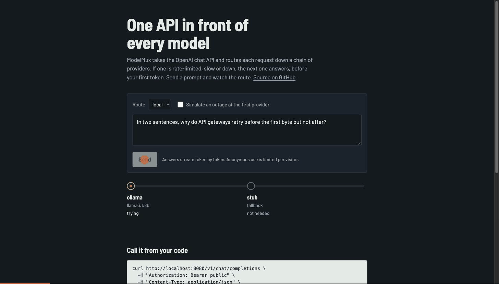

# ModelMux

[](https://github.com/amaanmithani/modelmux/actions/workflows/ci.yml)

One OpenAI-compatible API in front of many LLM providers. Each model name is a
**fallback chain**: if the first provider is rate-limited, slow or down, the next
one answers before your client sees a byte. Add exact and semantic caching,
per-tenant keys, rate limits and token budgets, usage events for billing, and
Prometheus metrics. It ships as a single Go binary with no framework.



## Why

Every team that ships an LLM feature ends up writing the same glue: retries
across providers, a cache, per-customer limits and a usage log. ModelMux is
that glue as one service, built to show its numbers rather than claim them.
The benchmark scripts and their raw output are committed, and the tables below
are generated from them.

## Quick start

```bash
# Local models via Ollama, with a stub fallback
ollama pull llama3.1:8b
go run ./cmd/modelmux -config configs/local.yaml
open http://127.0.0.1:8080        # playground
```

Any OpenAI SDK works unchanged:

```python
from openai import OpenAI
client = OpenAI(base_url="http://127.0.0.1:8080/v1", api_key="public")
client.chat.completions.create(model="local", messages=[{"role": "user", "content": "hi"}])
```

Or with Docker (runs `configs/demo.yaml`; set `GROQ_API_KEY` / `GEMINI_API_KEY` to use real models):

```bash
docker build -t modelmux . && docker run -p 8080:8080 -e GROQ_API_KEY=... modelmux
```

## What it does

| | |
|---|---|
| **Providers** | Two wire protocols cover most of the market: OpenAI-compatible (OpenAI, Groq, Gemini's OpenAI endpoint, Ollama, vLLM) and Anthropic Messages, translated both ways, including streaming and tool calls. |
| **Fallback chains** | `alias → [provider/model, …]`. Retries on 429, 5xx, timeouts, bad keys and connection errors; stops on 400/422, since the same body would fail everywhere. Streaming requests are retried only until the first chunk arrives. After that the client has partial output and a retry would duplicate it. |
| **Circuit breaker** | Per provider: opens after N consecutive failures, then lets exactly one probe through after the cooldown. Client disconnects never count against a provider. |
| **Exact cache** | LRU with TTL, per tenant. Only deterministic requests (`temperature: 0`) by default; `X-ModelMux-Cache: force` or `bypass` per request. Streamed and non-streamed requests share entries. |
| **Semantic cache** | Opt-in. Embeds single-turn questions and answers near-duplicates, scoped by tenant, system prompt and parameters, and a hit also requires matching entities. See the results for why. |
| **Tenants** | SHA-256-hashed API keys, per-key model allow-lists, token-bucket RPM, monthly token budgets reserved at admission and settled on completion. Optional anonymous access with per-IP (IPv6 per /64) and global limits, capped prompt and output size. |
| **Usage events** | One JSON event per admitted request ([schema](docs/usage-event.md)) to stdout or a batching webhook. The event id is the idempotency key. |
| **Observability** | Prometheus `/metrics` (requests, latency, per-provider attempts, fallbacks, breaker state, tokens, cache similarity), JSON logs, `/healthz`. |

Response headers say how each request was served: `X-ModelMux-Provider`,
`X-ModelMux-Fallbacks`, `X-ModelMux-Cache`, `X-ModelMux-Similarity`.

## Configuration

One YAML file; [`configs/example.yaml`](configs/example.yaml) documents every option.

```yaml
providers:
  - {name: groq, type: openai, base_url: "https://api.groq.com/openai/v1", api_key_env: GROQ_API_KEY, optional: true}
  - {name: claude, type: anthropic, api_key_env: ANTHROPIC_API_KEY}
  - {name: ollama, type: openai, base_url: "http://localhost:11434/v1"}
routes:
  - {alias: fast, targets: [groq/llama-3.1-8b-instant, ollama/llama3.1:8b]}
tenants:
  - {name: acme, key_sha256: "<sha256 of the key>", monthly_tokens: 5000000, rpm: 600, models: [fast]}
```

`optional: true` skips a provider whose key isn't set, so one config serves
partial deployments.

## Architecture

```
client ─► auth ─► validate ─► rate limit + budget ─► exact cache ─► semantic cache ──hit──► reply
                                                                        │ miss
                                                                        ▼
                                                     router: alias → [target₁, target₂, …]
                                                        breaker · first-byte timeout · fallback
                                                                        ▼
                                                  adapter (openai-compat │ anthropic ⇄ openai)
                                                                        ▼
                                           reply / SSE stream ─► cache store ─► usage event ─► sink
```

`internal/api` wire types · `internal/provider` adapters · `internal/router`
chains and breakers · `internal/cache` exact + semantic · `internal/tenant`
auth and limits · `internal/usage` events · `internal/server` HTTP, SSE and
metrics. Design notes and the things that didn't work are in [docs/WRITEUP.md](docs/WRITEUP.md).

## Results

Regenerate everything with `bench/run_all.sh`; this section is written by `bench/report.py`.

<!-- RESULTS:START -->
### Gateway overhead

k6 constant-arrival-rate 2000 req/s for 30s per run; 3 rounds, each running every variant; overhead = gateway minus direct within the same round, reported as median and min-max across rounds. Stub upstream with fixed 50ms latency over HTTP, caches off, k6 + gateway + stub on one machine. Machine: Apple M1 Pro, 8 cores. Overhead cells show the median across rounds, with the min–max in brackets.

| path | direct p50 / p99 | through ModelMux p50 / p99 | added at p50 | added at p99 |
|---|---|---|---|---|
| non-streaming, anonymous caller (no limits configured) | 50.16 / 50.67 ms | 50.30 / 51.30 ms | 0.14 ms (0.12–0.15) | 0.58 ms (0.41–2.67) |
| non-streaming, API-key tenant with rate limit + budget active | 50.16 / 50.67 ms | 50.31 / 51.43 ms | 0.14 ms (0.13–0.14) | 0.94 ms (0.15–0.99) |
| streaming, time to first byte | 50.14 / 50.91 ms | 50.24 / 50.87 ms | 0.10 ms (0.09–0.10) | 0.31 ms (-0.28–0.73) |

Every run held 1997 req/s with 0% errors and 0 dropped iterations. Gateway process: peak RSS 50.0 MB, median 37% of one core. The upstream is a local stub with fixed latency, so these numbers isolate what the gateway adds; against a real provider the added milliseconds are the same, but they're a much smaller fraction of the total.

### Fallback under injected faults

2000 requests per run (half streaming), 32 concurrent clients, real HTTP end to end, chain = [a, b], 3 runs per scenario with different fault seeds. recoverable = requests a did not serve (it failed, hung or its breaker was open) minus streams that failed after their first byte; recovered = served by b.

| scenario | success rate | recovered / recoverable | HTTP requests that reached `a` | p99 |
|---|---|---|---|---|
| **flaky-503**: a returns 503 on 30% of requests; breaker effectively off | 100.0% | all (596–621 per run) | 2000 | 6.0–8.4 ms |
| **hanging**: a hangs on 30% of requests (never sends a byte); first-byte/request timeout 200ms | 100.0% | all (587–630 per run) | 2000 | 205.8–208.9 ms |
| **a-down-breaker-off**: a returns 503 on every request; breaker off: every request pays a failed attempt | 100.0% | all (2000 per run) | 2000 | 6.3–12.0 ms |
| **a-down-breaker-on**: a returns 503 on every request; breaker on (5 failures, 1s cooldown): a is skipped while open | 100.0% | all (2000 per run) | 23–32 | 4.8–5.7 ms |
| **a-refusing**: a refuses TCP connections; breaker on | 100.0% | all (2000 per run) | 0 | 5.6–5.8 ms |
| **both-dead**: control: no healthy target exists | 0.0% | — (nothing healthy to fall back to) | 0 | 2.7–9.2 ms |
| **midstream**: a drops 30% of streams after the first chunk (not recoverable by design: bytes already sent) | 84.4–85.9% | all (304–308 per run) | 2000 | 6.6–14.5 ms |

Streams that fail *after* their first byte can't be retried by any proxy, because the client already has partial output. In the midstream scenario that was 283–312 streams per run. ModelMux ends them with an in-band error event and no `[DONE]`, and never caches them.

### Semantic cache: how much can it safely hit?

GLUE QQP validation, seeded balanced samples: 2000 calibration pairs choose the threshold (lowest τ with pairwise false-hit rate <= 0.010), 1000 held-out pairs are used for every reported number. Embeddings via http://localhost:11434/v1 (the runtime path); guard = cache.GuardKey (the runtime function). Cache simulation: all held-out q1 in one scope, each q2 looks up its nearest neighbour.

| embedding model | held-out AUC | no guard: τ → hits on paraphrases, false hits | with lexical guard | embed p50 |
|---|---|---|---|---|
| nomic-embed-text | 0.757 | no threshold meets the budget | τ=0.960 → 9.0% [6.8%–11.8%], 0.4% [0.1%–1.5%] | 18 ms |
| all-minilm | 0.871 | τ=0.975 → 7.6% [5.6%–10.3%], 0.8% [0.3%–2.0%] | τ=0.955 → 10.6% [8.2%–13.6%], 0.6% [0.2%–1.8%] | 15 ms |
| mxbai-embed-large | 0.886 | τ=0.965 → 13.8% [11.1%–17.1%], 0.8% [0.3%–2.0%] | τ=0.950 → 14.4% [11.6%–17.8%], 0.4% [0.1%–1.5%] | 27 ms |

In the cache simulation (every held-out question indexed, each paraphrase looked up by nearest neighbour), mxbai-embed-large with the guard answered 14.4% of paraphrase queries correctly and gave a wrong cached answer to 0.4% of all queries.

Why the guard exists: embeddings score near-identical questions about different entities as the same question. The top held-out non-duplicate for nomic-embed-text is *"What are some things new employees should know going into their first day at Spectrum Pharmaceuticals?"* vs *"What are some things new employees should know going into their first day at Lexicon Pharmaceuticals?"*, cosine 1.0000, which the guard blocks. A safe semantic cache catches only a minority of paraphrases, which is why it's off by default and off in the public demo.

Scan cost at capacity (2,000 entries × 1,024 dims, flat inner product): **0.99 ms** per lookup (`go test -bench SemanticLookup ./internal/cache`), small next to the embedding call itself.
<!-- RESULTS:END -->

## Limitations

- State is in memory: budgets, rate limits and caches reset on restart and aren't shared between replicas.
- Anthropic translation covers text and tool use; images, documents and extended-thinking blocks aren't translated.
- Token counts are estimated at about four characters per token when an upstream reports no usage, and such events carry `tokens_estimated: true`.
- A request reserves its worst-case token cost when admitted, so a tenant close to its budget can be refused a request that would have fit.
- Image tokens are estimated at a flat ~1,000 per image when the upstream reports no usage.

## Development

```bash
go test -race ./cmd/... ./internal/...      # 85% coverage gate in CI
golangci-lint run ./...
bench/run_all.sh                            # needs k6, Ollama and uv
```
